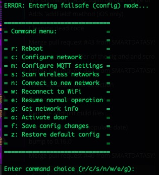

# CyGarage

[](https://travis-ci.com/cyrusbuilt/CyGarage)

Arduino-based (specifically the Adafruit Huzzah ESP8266) IoT garage door opener.

The code in this repository represents the Firmware for the CyGarage IoT garage door opener device, as well as some components for integrating with [OpenHAB2](https://openhab.org).  CyGarage is a [PlatformIO](https://platformio.org/) project and is meant to integrate with an existing garage door opener and provide 2 things: The ability to detect the door's state (open, close, or ajar) and the ability to control the door over HTTP/MQTT. Since there is an [ESP8266](https://www.adafruit.com/product/2471) at the heart of it, that means it is WiFi-enabled and is capable of OTA (Over-the-Air) firmware updates.

## Important Note on Security

CyGarage firmware versions prior to v1.3 had no security built-in and used basic unencrypted HTTP requests for control. There was no SSL (HTTPS) or authentication of any kind. This was a major concern because if someone opened access to the device through their firewall or if a malicious actor were to gain access to the WiFi LAN the device was attached to, being able to open the garage door was trivial. Simply send an HTTP POST to the activation URL and the door opens.  However, starting in v1.3, the default is to use [MQTT](http://mqtt.org/) to pass control messages in JSON format and in turn the device sends status messages in JSON format to MQTT subscribers (such as OpenHAB2). Additionally, these messages are transferred to/from MQTT over TLS using SSL certificates so that the messages are encrypted.  You cannot send control messages to CyGarage directly. You have to publish them to the control channel on the MQTT broker that CyGarage is subscribed to. Additionally, you would need the appropriate certificate and SHA256 fingerprint to connect to and publish the control messages. This security architecture is certainly not infalible, but definitely adds a strong layer of security that was non-existent in previous versions and also provides some means of hardening that security even further (such as using certificates signed by an RSA CA (as opposed to self-signed certs) and using password authentication with the MQTT broker on top of that. You can even configure OpenHAB2 to communicate with the MQTT broker using TLS as well, although this is overkill if the broker is running on the same machine as OpenHAB2 and/or the MQTT standard port is bound to the OpenHAB2 host).

## Theory of Operation

The way this is intended to work is: when the device detects that the door is open or ajar, the user can see this status and (if integrated with OpenHAB or some other similar system) and can get notifications when this occurs. When the device receives the activate command, it then triggers a relay which simulates the garage door button press which will in turn raise or lower the door depending on the current state.

## Configuration

The config.h file contains default configuration directives. These options are the hardcoded default values that the system will initially boot with. However, if there is a config.json file present in the root of the SPIFFS file system, then it will override these defaults. Here we'll discuss each option:

- CG_MODEL_2: Comment this line if you are building the firmware for the Model 1 (single door version). By default, this firmare supports Model 2.
- ENABLE_OTA: If you do not wish to support OTA updates, just comment this define.
- ENABLE_MDNS: If you do not wish to support [MDNS](https://tttapa.github.io/ESP8266/Chap08%20-%20mDNS.html), comment this define.
- ENABLE_WEBSERVER: This option is disabled by default for security reasons. Only uncomment this line if you know what you are doing or if you absolutely need it for backward compatibility with older versions of CyGarageMobile.
- CONFIG_FILE_PATH: This is the path to the configuration file. The default is /config.json. The values in this file will override these defaults.
- DEFAULT_SSID: Change this line to reflect the SSID of your WiFi network.
- DEFAULT_PASSWORD: Change this line to reflect the password to your WiFi network.
- WEBSERVER_PORT: If you wish to use a port number other than the standard HTTP port, you can change that here. This option is ignored if ENABLE_WEBSERVER is disabled.
- CLOCK_TIMEZONE: The GMT offset for your timezone (EST [America/New York] is -4 when observing DST. It's -5 when not.)
- SERIAL_BAUD: While it is not recommended, you can change the BAUD rate of the serial port here.
- CHECK_WIFI_INTERVAL: The interval (in milliseconds) to check to make sure the device is still connected to WiFi, and if not attempt to reconnect. Default is 30 seconds.
- CHECK_SENSORS_INTERVAL: The interval (in millisceonds) to check the door contact sensors to determine door state. Default is 3 seconds.
- CLOCK_SYNC_INTERVAL: The interval (in milliseconds) to try to resync the clock with NTP. Default is 1 hour.
- ACTIVATION_DURATION: The amount of time (in milliseconds) to activate the door relay. Default is 2.5 seconds and is recommended this value not be changed unless you have good reason for doing so.
- DEVICE_NAME: This essentially serves as the host name of the device on the network.
- CHECK_MQTT_INTERVAL: The interval (in milliseconds) to check connectivity to the MQTT broker. If the connection is lost, a reconnect will occur. The default value is 35 seconds.
- MQTT_TOPIC_STATUS: The MQTT status topic to publish device status messages to. Default is 'cygarage/status'.
- MQTT_TOPIC_CONTROL: The MQTT control topic to subscribe to for control messages. Default is 'cygarage/control'.
- MQTT_BROKER: The hostname or IP of the MQTT broker.
- MQTT_PORT: The port on the MQTT broker to connect to. The default is 8883 (default port for MQTT over TLS).
- OTA_HOST_PORT: Defines the port to listen for OTA updates on. This option is ignored if ENABLE_OTA is disabled.
- OTA_PASSWORD: The password used to authenticate with the OTA server. This option is ignored if ENABLE_OTA is disabled.
- ip: The default IP address. By default, this devices boots with a static IP configuration. The default IP is 192.168.0.200. You can change that here if you wish.
- gw: The default gateway address. The current default is 192.168.0.1. You can change that here if you wish.
- sm: The subnet mask. By default, it is 255.255.255.0, but you can change that here if need be.

To override the default configuration options, you need to upload a filesystem image containing a file named 'config.json' in the root of the SPIFFS filesystem. The file should like something like this:

```json
{
    "hostname": "CYGARAGE",
    "useDHCP": false,
    "ip": "your_device_ip_here",
    "gateway": "your_gateway_here",
    "subnetMask": "your_subnet_mask_here",
    "wifiSSID": "your_wifi_SSID_here",
    "wifiPassword": "your_wifi_password_here",
    "webserverPort": 80,
    "otaPort": 8266,
    "otaPassword": "your_OTA_password_here",
    "mqttBroker": "your_MQTT_broker_here",
    "mqttPort": 8883,
    "mqttControlChannel": "cygarage/control",
    "mqttStatusChannel": "cygarage/status",
    "mqttUsername": "your_mqtt_username_here",
    "mqttPassword": "your_mqtt_password_here",
    "serverFingerprintPath": "/mqtt.fpn",
    "caCertificatePath": "/ca.crt"
}
```

This configuration file is pretty self explanatory and one is included in the source. The file *MUST* be located in the "data" directory located in the root of the project in order to be picked up by the flash uploader (either via Serial or OTA). Each of the options in the configuration file are self-explanatory and match up with the hard-coded default settings mentioned above. If this file is not present when the firmware boots, a new file will be created and populated with the hardcoded defaults. These defaults can then be changed via the fail-safe menu and saved. You'll notice a couple of additional options in the config.json file not present in config.h. They are as follows:

- mqttUsername: If you have enabled password authentication on your MQTT broker, provide the username here.
- mqttPassword: If you have enabled password authentication on your MQTT broker, provide the password for the username above. If *both* the username and password are provided, then CyGarage will attempt to connect to the broker with the provided credentials; Otherwise, it will attempt to connect without credentials.
- mqttControlChannel: The MQTT control topic to subscribe to in order to receive device commands.
- mqttStatusChannel: The MQTT status topic to publish device status to.
- serverFingerprintPath: The path to the file containing the MQTT broker's SHA256 fingerprint. Default is '/mqtt.fpn'.
- caCertificatePath: The path to the CA certificate that the MQTT broker's certificate was signed with. Default is '/ca.crt'.

If the above values are omitted or invalid, then the system will fail during loadCertificates() and will not be able to connect to MQTT.

## Getting Started

After you've configured everything the way you need it (as discussed above), build the firmware by either clicking "Build" in the PlatformIO tasks menu, or by opening a terminal to the project directory and typing:

```bash
> platformio run
```

NOTE: The first time you flash the Huzzah, you need to do so over serial (since the OTA code isn't there yet), but subsequent uploads can be done via OTA if configured properly.

The next thing to do is connect the Huzzah to your computer using an FTDI cable like [this one](https://www.adafruit.com/product/70?gclid=EAIaIQobChMIm7-50ZiZ5AIVlIvICh284QPxEAQYBCABEgJkcPD_BwE) and then configure the port in platformio.ini like so:


With the above mentioned FTDI cable attached to my MacBook, the port appears as it does in the config file above (usually PlatformIO is pretty good about auto-detecting the port for you).

Now all you have to do is flash the firmware onto the Huzzah. You can do this by first pressing and holding the "GPIO" button and then press the "reset" button and let go of both on the Huzzah to put it into flash mode (this is not necessary when you flash via OTA), then click the "Upload and Monitor" task in the PlatformIO menu or by typing the following into the terminal:

```bash
> platformio run --target upload
> platformio device monitor --baud 115200 --port /dev/cu.usbserial-AL05HSL2
```

Once complete, press the "reset" button on the Huzzah. You should see the device boot up in the serial console. Now put the device back into flash mode. If you are using MQTT over TLS (recommended) then visit the readme in the "openhab" folder (even if you ultimately are not connecting MQTT to OpenHAB) for instructions on generating the necessary files for connecting CyGarage to MQTT, otherwise just click the "Upload File System Image" task in the PlatformIO menu. When finished, press the "reset" button again and the device will reboot and come back up with your new configuration settings.

## Webserver Routes (Deprecated)

These routes are *ONLY* exposed if the ENABLE_WEBSERVER directive is uncommented.

- GET /    (Returns "Server ok..." in plain text)
- GET /version (Returns the firmware version in plain text)
- GET /device/status (Returns the device (door) status in plain text)
- POST /device/activate (Activates the relay and returns "OK" in plain text)

## OTA Updates

If you wish to be able to upload firmware updates Over-the-Air, then besides leaving the ENABLE_OTA option uncommented, you will also need to uncomment all the upload_* lines in platformio.ini, and change the line 'upload_port = ' line to reflect the IP of the device and the line '--auth=' to reflect whatever OTA_PASSWORD is set to. Then when you click "upload" from the PlatformIO tasks (or if you execute 'platformio run --target upload' from the command line) it should upload directly over WiFi and once completed, the device will automatically flash itself and reboot with the new version. If you wish to upload a new configuration file, you can also do this via OTA. Assuming the above-mentioned settings are configured, you can then click "Upload File System Image" from the PlatformIO project tasks.

## Serial Console Menu

If the device ever fails to connect to WiFi or if you press the 'I' key on your keyboard while in the serial console, normal operation of the device is suspended and the device will fall into a 'fail-safe' mode and present the user with a command menu. Here we will discuss those menu options:



- Reboot - press 'r' - Self-explanatory. Reboots the device.
- Configure network - press 'c'. Configure the network.

- - Press 'd' for DHCP or 't' for static IP.

- - If static, then you will also be prompted for the IP, gateway, and subnet mask.

- Scan wireless networks - Press 's'. This will scan for available wireless networks and dump a table of the networks it found to the console.

- Connect to new network - Press 'n'. This option prompts the user for a new SSID and password for different WiFi network to connect to.

- Reconnect to WiFi - Press 'w'. This can be used to reconnect to the current WiFi network if the connection was lost.

- Resume normal operation - Press 'e'. This will leave fail-safe mode and attempt to resume normal operation by resuming any suspended tasks and verify network connectivity.

- Get network info - Press 'g'. This will dump network information to the serial console (IP config, WiFi connection info).

- Activate door (1) - Press 'a'. This allows the user to manually activate the door. Activates door 1 on Model 2.

- Activate door 2 - Press 'b'. This allows the user to manually activate door 2. Not present on Model 1 firmware.

- Save config changes - Press 'f'. This will save any configuration changes currently stored in memory to config.json.

- Restore default config - Press 'z'. This will restore the firmware configuration back to the factory default settings (the hard-coded defaults). It does this by simply deleting the existing config.json file from flash storage and then immediately rebooting the firmware. Upon reboot, a new config.json file is created and populated with the default settings which are then applied to the running configuration in memory.

## Dependencies

The firmware dependencies will be installed automatically at compile-time.  However, if you wish to install dependencies prior to compiling (for intellisense or to clear warnings/errors in the VSCode editor) you can run the following command:

```bash
platformio lib install
```

Then go to the platformio menu and click "Rebuild IntelliSense index".

## Tools

Included with this firmware is a few handy tools:

- /disassemble.sh - Disassembles the compiled firmware into a plain text file called 'disassembly.txt'. If the firmware has not been built, it will be compiled first, then disassembled. The disassembly output contains the assembly code, C++ calls, and instruction addresses useful for debugging the executing code or determining the cause of crashes at addresses reported by ESPCrashMonitor during boot.

- tools/clear_flash.sh - Completely clears the flash memory on the ESP8266 of all data (including firmware).

- tools/serial_monitor.sh - Just runs the serial monitor. Pretty much the same as clicking 'Monitor' in the platformio menu, but uses its own settings instead of those found in platformio.ini.

- tools/generate_mqtt_certs.sh - Generates the necessary certificates for the MQTT broker and CyGarage to communicate over TLS.

## Mobile App

If you choose not to integrate with OpenHAB2, you can get similar functionality using the mobile app for iOS and Android located [here](https://github.com/cyrusbuilt/CyGarageMobile). (NOTE: As of 8/21/2019, the most current version of CyGarageMobile is only compatible with CyGarage firmware version prior to v1.3, or if the ENABLE_WEBSERVER option is enabled in v1.3 or higher). If you intend to integrate with OpenHAB2, you can also use the OpenHAB mobile application (recommended).

## Integration with Garage Door opener

Once the board is assembled (either by having the board etched or by just soldering the necessary components to perf board and making the connections manually), you will need to mount the board somewhere and then make the necessary connections to the opener. If using door contacts is not an option for you (which was the case for me), it is possible to use the limit switches already mounted to the track to tell the motor to stop when the door is all the way open or all the way closed. Many garage door openers have voltage present on these limit switches. In the case of my Genie, there was 7.7V DC present when the limit switches were open, which then goes to 0V when the switches closed. We can't have that voltage (or current) being fed back in to the inputs on the ESP8266, so rectifier diodes (D1 and D2) were added to the circuit just before J2 and J3 (respectively). This allows us to use the existing switches, but still isolate the ESP8266 from the garage door opener's voltage and prevent ground loops. That being said, the first thing to do is to locate the terminals on the garage door opener that the wall-mounted push button wires to.

*MOST* garage door openers have a button mounted near the interior door that you can press to open/close the garage door. Follow the wires from that button and see which terminals they wire into on the opener. You need to connect 2 wires from the push button terminals on the opener to the COM and NO screw terminals on the Power Relay FeatherWing (I ran appropriate lengths of 18/2 (18 Guage / 2 lead) for all my connections and mounted the CyGarage board on the wall where I could easily get to it). Next, connect 2 wires each to J2 and J3 and then connect the other ends of each to either magnetic door contacts or the limit switches mounted on the trolley track.  If connecting to the limit switches, it is important to be sure that you are connecting the outside terminals (think of these as the negative or ground terminals) to the frame or ground on the track itself and the inside terminals (think of these as the positive terminals) to the switch leads themselves.

Last, you need to connect a 5VDC 1A power supply to J1. I personally used a power adapter for an old USB hub I still had laying around. But a lot of cell phone chargers and the like would work too, or the 5VDC rail from an old PC power supply, or you could build one, which wouldn't be that difficult. If you intend to mount the board somewhere that will be difficult to hook up to a computer later, it would be best to make sure you flash the ESP8266 with the firmware first. Since mine was mounted on the wall near one of my benches, I just set my laptop on the bench and connect the USB-to-Serial cable and flash it right there (when necessary, I mostly just use the OTA feature). I would HIGHLY recommend that you use female headers to create a sort of 'socket' for the Huzzah. That way it can be replaced if something happens or so you can pop it out and flash it if needed.

For Model 2:

The same as above except J3 and J4 connect to door contacts or limit switches on door 2, and relay 2 connects to the push button terminals on the opener for door 2.